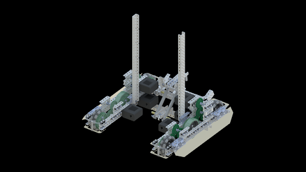
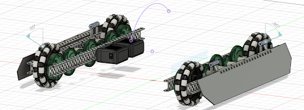
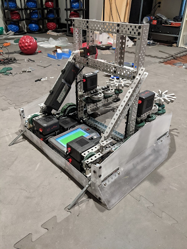

# Drivetrain

This is the second time we’ve talked about the drivetrain, but it’s a very important part of your robot. This is going to teach you the forbidden knowledge of good drivetrains and how you should use them. For this section, there’s only going to be one video but it’ll cover everything.

<iframe width="560" height="315" src="https://www.youtube.com/embed/8jxQENu5O8E" title="Robotics Introduction - Building Techniques - Drivetrains" frameborder="0" allow="accelerometer; autoplay; clipboard-write; encrypted-media; gyroscope; picture-in-picture; web-share" allowfullscreen></iframe>

Bracings
Your drivetrain should include 2 types of bracings. It can hold other types of bracings, but those change, these are always necessary.
Inner Brace:
Your inner brace holds one side of your drivetrain together. Usually it’s a standoff in the middle or something similar.
Cross-Drivetrain Brace:
This brace crosses your drivetrain to hold it together. You should probably have multiple of these. My general rule is to have 2 in the center that span the entire drivetrain, 1 that spans the inside of the drivetrain or the entire drivetrain, and any amount of other braces.

## Sizing

For Omni or Traction wheels you generally want 6 dots wide. This allows you to fit an Omni wheel and a sprocket inside, even though it’s tight. You do not need to have room for the wheel to turn like a car’s wheels. Mecanum wheels may need more space because they’re larger.

The length of your drivetrain depends on what you want to do. A shorter drivetrain lets you have more open space in the front or back, but you might lose stability with farther back wheels. A longer drivetrain is going to let you be more stable, but you lose space. Many times when designing a drivetrain you should create it in 35 long or 30 long. If it has sprockets in it, the size is adjustable. If it has gears the size is adjustable to a degree.

Gearing and Speeds
Your drivetrain uses the same physics as normal gears. But, we should take into account the different wheel sizes.
Let’s say we have a 200 rpm motor directly powering our 4in wheel. That wheel goes at 200 rpms, but it’s speed is 800pi in/min (circumference times rpms = in/min). Let’s take a 200 rpm motor directly powering a 3.25 in wheel. It still goes at 200 rpms, but it’s speed is now 650pi in/min.
We could try and compare these speeds in in/min, but we can also compare them in rpms of a 4in wheel. We divide each speed (in/min) by 4pi (the circumference of a 4in wheel) to get 200 rpm for the 4in wheel and 160 rpm for the 3.25 in wheel. These are a bit easier to compare and might help you visualize speeds better.
Usually you want 200-300 rpms for your robot. Too slow and you can’t do anything. Too fast and you have no torque.

## H-Drive vs X-Drive

The most common types of drivetrains are H and X-Drives. They’re named because of the shape that the entire drivetrain makes. Your normal drivetrain, with wheels all in a line, forms an H after you add a brace. An X drive forms an octagon, with wheels along the diagonals. The braces do not normally cross to make the X, rather they’re similar to the H-Drive bracing.
The differences about an X-Drive include:

-   All Omni wheels
-   Ability to strafe
-   Easiest as direct drive
-   There must be 4 motors
-   √2 x faster than an H-Drive

So if you think about how the X-Drive moves and how the wheels turn, you’ll see that it can move in any direction without turning. This is amazing for it because it allows you to move faster. You also have to code and drive it differently, but that doesn’t affect building too much. You can also see how you would need 4 direct drive motors because you can’t turn your gears around a corner.
What you might not understand is why it’s √2 x faster. Its tradeoff is that it has √2 x less torque. Here’s a much better explanation: [Why is X-Drive Faster? - AURA](https://web.archive.org/web/20230118013035/https://aura.org.nz/why-is-x-drive-faster/)

## Preventing Defense

VEX Robotics is played in a competitive game. This means that there will inevitably be opposing robots trying to prevent your robot from scoring. One way teams will do this is by pushing your robot out of the way, typically from the side. This can be prevented by using a center traction wheel and/or adding skirts/wedges.

## Center Traction Wheel

A traction wheel in the center of your drivetrain is a very good way of preventing being pushed from the side. However, it is key that the traction wheel is located near the center of rotation for the robot, because it will have the least effect on the turning of the robot. Traction wheels have a lot of grip, but when a robot is turning, this grip works against it, because the wheel must drive in an arc, which means the wheel must skid somewhat. This is why we always recommend using omni wheels, because the small rollers help decrease the friction involved in turning. With the traction wheel in the center of the robot, however, the arc when turning is the smallest, which means the effect of friction is the lowest. Below is a CAD render of 53A’s Worlds drivetrain for Tipping Point, which uses a center traction wheel, along with skirts.

<!--TODO: crop this-->

## Skirts

Skirts are pieces of lexan mounted on the side of a drivetrain at an angle to prevent pushing. This works by creating a ramp for opposing robots to drive up if they try to push, thus reducing their pushing power in the horizontal direction. These are usually mounted on hinges and backed by a piece of c-channel for rigidity, although alternative methods can be used if hinges stick out past the c-channel too much. Below is a CAD screenshot of 53E’s early season Tipping Point design, with a low profile custom hinge mechanism using standoffs and collars.connected to an 1-by angle.

## Wedges

Wedges are similar to skirts in that they are a slanted piece designed to cause other robots to ride up them, but wedges are mounted on the back of the drivetrain and typically used in a defensive manner to disrupt opposing robots. Below is a picture of 1721G’s Change Up robot, which was a defense bot that utilized aggressive driving and wedges very well.

