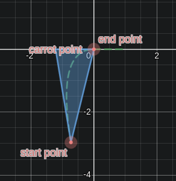

# Boomerang Controller

Prerequisite knowledge:

-   trigonometry

The boomerang controller isn't really a controller, although the VEX community calls it that. The boomerang controller is a method of moving the bot to a point on the field. It also lets you specify the absolute rotation the bot will end up in. This is 2D motion, so it requires odometry to function. The boomerang controller actually uses a PID controller underneath to get to it's target.

## Theory

The algorithm doesn't actually have the robot move to the target point, it has it move it an intermediate carrot point. As the robot gets closer to the carrot point, the carrot point moves closer to the target point. This causes the robot to move towards the target.

<figure markdown>
  { width="300" }
  <figcaption>In this example, the bot is moving to (0,0) and will end with a rotation of 0 degrees.</figcaption>
</figure>

## Math

The math to calculate the carrot point is pretty simple.

First we calculate the distance between the start point and the end point.

The following variables are used:

-   $h$ is the distance between the start point and end point.
-   $x_{start}$ is the x coordinate of the current position of the robot.
-   $y_{start}$ is the y coordinate of the current position of the robot.
-   $x_{end}$ is the x coordinate of the target position.
-   $y_{end}$ is the y coordinate of the target position.
-   $x_{carrot}$ is the x coordinate of the carrot point.
-   $y_{carrot}$ is the y coordinate of the carrot point.
-   $d_{lead}$ is the gain that controls how far the carrot point is away from the end point. Can be a value between 0 and 1.

$$
h=\sqrt{x_{start}-x_{end}+y_{start}-y_{end}}
$$

Then we calculate x the coordinate of the carrot point by subtracting the y component of $h$ from $x_{end}$

$$
x_{carrot}=x_{end}-h\sin(\theta_{end})*d_{lead}
$$

And we calculate y the coordinate of the carrot point by subtracting the x component of $h$ from $x_{end}$

$$
y_{carrot}=y_{end}-h\cos(\theta_{end})*d_{lead}
$$

## Implementation

This algorithm doesn't provide any actual movement control, so we'll use PID. You'll need to PID controllers, one for the linear movement, and one for the rotational movement. There is more information on how to move to 2D points [here](./move-to-point.md).

The carrot point changes over time, so a control loop is required. Every time the loop runs you'll need to:

1. Get the current position of the robot.
2. Calculate the new carrot point.
3. Calculate the linear error from the robot to the carrot point.
4. Get the output of the linear PID controller.
5. Calculate the rotational error from the robot to the carrot point.
6. Get the output of the rotational PID controller.
7. Move the motors with the outputs of the controllers.

Here is some pseudocode for that loop:

```cpp

class Point {
  public:
  float x;
  float y;
  float theta;

  Point(float x, float y, float theta) {
    x = x;
    y = y;
    theta = theta;
  }

  float getLinearDist(Point other) {
    return std::hypot(this->x - other.x, this->y - other.y);
  }

};

bool atTarget;
float lead = 0.5;

while (!atTarget) {
  Point target(10, 10, 90);
  Point currentPosition = getCurrentPosition(); // Return position from odometry

  Point carrotPoint = Point(
      (target.x - distance * sin(target.theta) * lead),
      (target.y - distance * cos(target.theta) * lead),
      0.0);

  // Movement code ...

}
```
