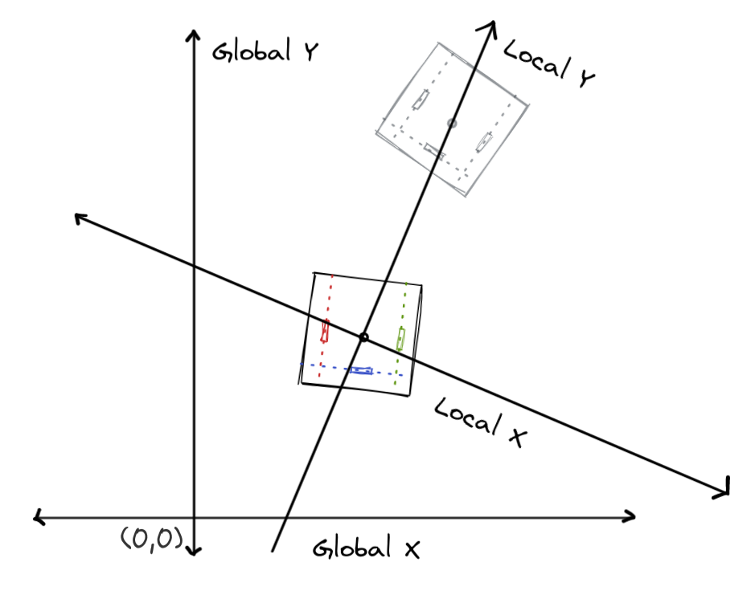
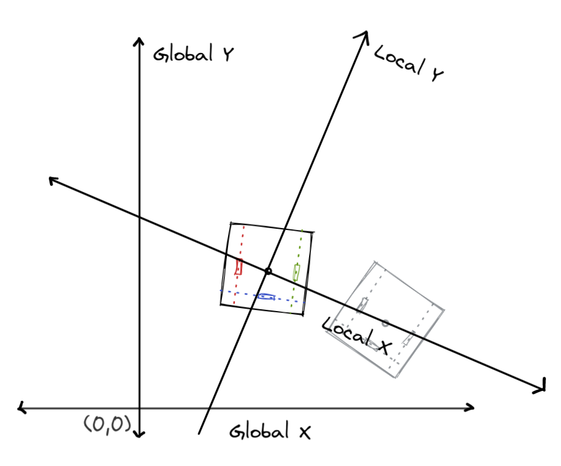
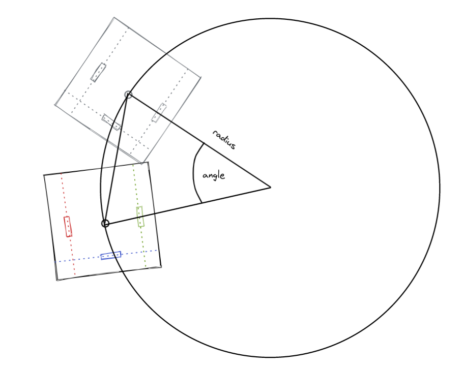

# Odometry

Prerequisite Mathematical Knowledge:

-   algebra
-   trigonometry

Odometry lets you track the position of the robot in 2D space, using Cartesian coordinates. This method of tracking was popularised by team 5225, the Pilons. If you want to read more about how to derive the math behind odometry, you should read their [guide](http://thepilons.ca/wp-content/uploads/2018/10/Tracking.pdf).

This section will focus mostly on the steps required to implement odometry, and the equations used to get there. If you want full implementation examples, look at the [resources](../../resources.md) page, under the High Quality Code Section. Most programs there should implement it.

You can also look at one of our teams who've implemented it:

-   [53D-Spin-Up-2022-2023](https://github.com/Area-53-Robotics/53D-Spin-Up-2022-2023/blob/main/src/utilFiles/odometry.cpp)

## Theory

Odometry is a very useful tool. It provides the absolute position of your robot's tracking center in 2D space. The location of the tracking center is dictated by the placement of your tracking wheels (see below). This means that you can account for error that is created during movement. If one of the movements of your bot is off, the next movement will correct for that, as long as you tell your bot to move to absolute positions on the field.

That being said there are some limitations. Odometry can often drift, which can lead to small error that builds up over time. Teams often solve this problem by aligning their robot against a wall, and then resetting the robot's position in the odometry.

## Hardware Prerequisites

Your robot needs some way to track its position. This can be achieved in multiple ways. The main things you need are:

-   a way to track the robot's movement forwards and backwards
-   a way to track the robot's movement side to side
-   a way to track the robot's rotation

Typically this is done with passive tracking wheels. These are wheels that are directly attached to an encoder that tracks their position. Below is a typical tracking wheel:

<figure markdown>
  { width="300" }
  <figcaption>Credit to LemLib for this image</figcaption>
</figure>

Usually you need three of them, two parallel to each other, and one perpendicular. The two parallel provide forwards and backwards tracking, as well as rotation, while the perpendicular one provides side to side movement. You can also use an IMU Sensor in the place of one of the parallel tracking wheels.

While you could just use the integrated motor encoders, it is usually not advised, because of wheels slipping, and gear slop. Sensors get less accurate the farther away they are from what they're tracking, that's just a fact of life.

The position of your tracking wheels dictates your tracking center.

<figure markdown>
  { width="300" }
  <figcaption>Credit to LemLib for this image</figcaption>
</figure>

## Math

First we need to define some variables:

-   $s_L$ is the distance from the left tracking wheel to the tracking center.
-   $s_R$ is the distance from the right tracking wheel to the tracking center.
-   $s_S$ is the distance from the center tracking wheel to the tracking center.
    <!---   $r_A$-->
    <!---   $r_L$-->
    <!---   $r_R$-->

Odometry is the compound change in position of the robot over time. Essentially, the final position can be calculated as the sum of all of the movements up to that point. The move often the change in position is calculated, the more accurate the position is.

<figure markdown>
  { width="800" }
</figure>


The first thing that needs to be calculated is the rotation of the robot. This can be calculated like this:

$$
\Delta\theta=\frac{\Delta L-\Delta R}{s_L+s_R}
$$

The function is only concerned with the difference between $\Delta R$ and $\Delta L$, so we can use the total distance the wheels have traveled to find the current absolute orientation.

Now we need a way to calculate the distance the robot has actually traveled. The first thing we need is a local coordinate system. This is a temporary coordinate plane that assumes that we use as an in between step every time we need to calculate the distance the robot has moved. This local coordinate system assumes that the robot's starting position is $(0,0)$.

The local y coordinate is the distance tracked by the left or right tracking wheel.

<figure markdown>
  { width="800" }
</figure>

The local x coordinate is the distance tracked by the center tracking wheel

<figure markdown>
  { width="800" }
</figure>

If the change in rotation is zero, the distance traveled is simply equal to the distance the tracking wheels have traveled.

$$
\Delta Y_{local}=\Delta L
$$

$$
\Delta X_{local}=\Delta S
$$

However, if the robot turned while making it's movement, the calculation becomes more complicated.

<figure markdown>
  { width="800" }
</figure>

As you can see in the image above, the actual distance traveled by the robot is not equal to the arc length that the wheels create. We can calculate the actual distance by using this formula:

$$
\Delta X_{local}=2\sin{\frac{\theta}{2}}*\left(\frac{\Delta S}{\Delta \theta}+s_S\right)
$$

$$
\Delta Y_{local}=2\sin{\frac{\theta}{2}}*\left(\frac{\Delta L}{\Delta \theta}+s_L\right)
$$

Now we need to convert these local coordinates to the change in global coordinates (the actual position of the robot).

$$
\Delta X_{global}=\Delta X_{local}*sin(\theta)-\Delta Y_{local}*cos(\theta)
$$

$$
\Delta Y_{global}=\Delta X_{local}*cos(\theta)-\Delta Y_{local}*sin(\theta)
$$

## Implementation

Odometry usually runs in an infinite loop, for the duration of the program. Usually you would put it in its own task, so that it can run concurrently to the main program.

Every time this loop runs, you need to do these things:

<!-- prettier-ignore-start -->
1. Store the values of the encoders in variables.
```cpp
leftPosition = getLeftEncoderValue(); // Returns the distance the encoder has traveled, in degrees.
rightPosition = getRightEncoderValue();
perpendicularPosition = getPerpendicularEncoderValue();
```
2. Calculate the change in encoder values since the last loop, and then convert that value into distance traveled. The units of this variable will be whatever the units of WHEEL_RADIUS are, usually inches.
```cpp
deltaLeft = (leftPosition - prevLeftPosition) * (M_PI / 180) * WHEEL_RADIUS; // Convert degrees to radians
deltaRight = (rightPosition - prevRightPosition) * (M_PI / 180) * WHEEL_RADIUS; // You can omit this if you have an IMU
deltaPerpendicular = (perpendicularPosition - prevPerpendicularPosition) * (M_PI / 180) * WHEEL_RADIUS;
```
3. Update the previous values of the encoders.
```cpp
prevLeftPosition = leftPosition;
prevRightPosition = rightPosition;
prevPerpendicularPosition = perpendicularPosition;
```
4. Calculate total distance traveled for each encoder. If you have an IMU you can skip this step.
```cpp
totalDeltaLeft += deltaLeft;
totalDeltaRight += deltaRight;
totalDeltaPerpendicular += deltaPerpendicular;
```
5. Calculate the current absolute orientation of the robot. This is the offset of the robot from the field.
If you're using parallel tracking wheels:
```cpp
// TRACKING_WIDTH is the distance between the two tracking wheels in inches
currentAbsoluteOrientation = (totalDeltaLeft - totalDeltaRight) / (TRACKING_WIDTH);
```
If you have an IMU:
```cpp
currentAbsoluteOrientation = getImuHeading() * M_PI / 180; // Convert degrees to radians
```
6. Calculate deltaTheta (change in rotation).
```cpp
deltaTheta = currentAbsoluteOrientation = prevTheta;
prevTheta = currentAbsoluteOrientation;
```
7. Now we get to the hard part. We now have to calculate local offset. This is the distance the robot has traveled relative to its rotation. If deltaTheta is zero, the robot moved in a perfectly straight line. This distinction is mainly to prevent division by zero.
```cpp
deltaXLocal = deltaPerpendicular;
deltaYLocal = deltaLeft;
```
If deltaTheta is any other value, we calculate local coordinates like this:
```cpp
// LEFT_TRACKING_RADIUS is the distance from the left tracking wheel to the tracking center of the robot
// PERPENDICULAR_TRACKING_RADIUS is the distance from the perpendicular tracking wheel to the tracking center of the robot

deltaXLocal = 2 * sin(deltaTheta) * ((deltaPerpendicular / deltaTheta) + PERPENDICULAR_TRACKING_RADIUS);

deltaYLocal = 2 * sin(deltaTheta) * ((deltaLeft / deltaTheta) + LEFT_TRACKING_RADIUS);
```
8. Calculate the average angle for this loop.
```cpp
avgTheta = currentAbsoluteOrientation - (deltaTheta / 2);
```
9. Calculate the change in global coordinates. This is done by taking the x and y components of the local coordinates.
```cpp
deltaXGlobal = (deltaYLocal * cos(avgTheta)) -
               (deltaXLocal * sin(avgTheta));

deltaYGlobal = (deltaYLocal * sin(avgTheta)) -
               (deltaXLocal * cos(avgTheta));
```
10. Check to see if your angles are under zero, or over 2$\pi$ (360 degrees), and wrap them if they are.
```cpp
while (currentAbsoluteOrientation >= 0) {
  currentAbsoluteOrientation -= 2 * M_PI;
}

while (currentAbsoluteOrientation < 0) {
  currentAbsoluteOrientation += 2 * M_PI;
}
```
11. Update the global coordinates. The global coordinates are the actual Cartesian coordinates of your robot.
```cpp
currentXPosition += delta_x_global;
currentYPosition += delta_y_global;
currentTheta = current_absolute_orientation;
```
!!! note
    This implementation assumes that the starting point of the robot is $(0,0)$. It is recommended that to offset the starting position of the robot in the code so that the coordinates for items of interest the same. For example, if there  is a game piece at $(10,10)$, you wouldn't want the starting position of your robot to affect the position in the code of the game piece. Choose a point on the field, and make that your origin. Usually, people use either the bottom left corner, or the direct center of the field.
<!-- prettier-ignore-end -->
