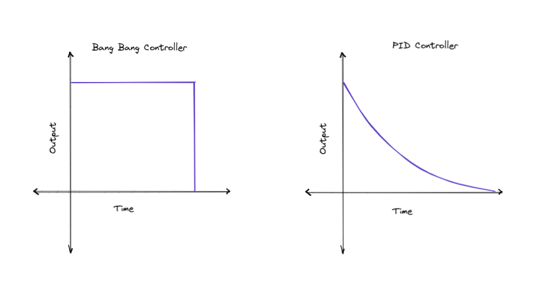
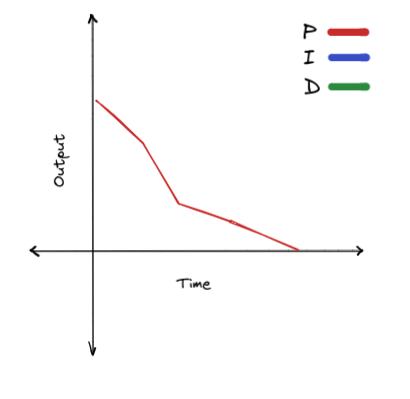
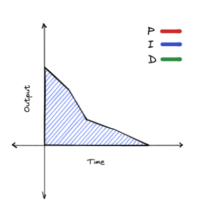
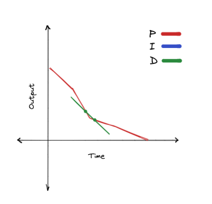

# PID Controller

## History

From [Wikipedia](https://en.wikipedia.org/wiki/PID_controller#Origins):

> It was not until 1922, however, that a formal control law for what we now call PID or three-term control was first developed using theoretical analysis, by Russian American engineer Nicolas Minorsky. Minorsky was researching and designing automatic ship steering for the US Navy and based his analysis on observations of a helmsman. He noted the helmsman steered the ship based not only on the current course error but also on past error, as well as the current rate of change; this was then given a mathematical treatment by Minorsky. His goal was stability, not general control, which simplified the problem significantly. While proportional control provided stability against small disturbances, it was insufficient for dealing with a steady disturbance, notably a stiff gale (due to steady-state error), which required adding the integral term. Finally, the derivative term was added to improve stability and control.

> Trials were carried out on the USS New Mexico, with the controllers controlling the angular velocity (not the angle) of the rudder. PI control yielded sustained yaw (angular error) of ±2°. Adding the D element yielded a yaw error of ±1/6°, better than most helmsmen could achieve.

## Theory

PID controller can be used anywhere a bang bang controller could be used. Similar to the bang bang controller, it uses closed loop control to adapt to interference. They are very precise, and are the bread and butter of autonomous movement. The fundamental difference between a bang bang controller and a PID controller is that the output varies based on the proximity to the target. The PID controller has a lower output as the system moves close to the target. This makes it much better than the bang bang controller, which assumes that the system can go from maximum speed to halted instantly.

<figure markdown>
  { width="800" }
</figure>

PID stands for proportional, integral, derivative. These are the three components of the loop. These not all required. As long as your loop has the proportional term, it will function.You can make a loop with:

-   P
-   PI
-   PD
-   PID

## Math

Assuming these variables:

-   $p$ is the proportional term
-   $i$ is the integral term
-   $d$ is the derivative term
-   $k_p$ is the proportional gain
-   $k_i$ is the integral gain
-   $k_d$ is the derivative gain
-   $o$ is the output of the loop
-   $s_{target}$ is the target state
-   $s_{current}$ is the current state

The output of the controller is equal to all of the terms multiplied by their respective constants, added together.

$$
o=p*k_p+i*k_i+d*k_d
$$

### Proportional

The proportional is the core of the PID loop. It is simply equal to error (the distance from the target). As the system gets close to the target, error decreases. If the system passes the target, error is negative, meaning the system will travel back to the target.

<figure markdown>
  { width="300" }
</figure>

We can calculate proportional as the target state subtracted by the current state:

$$
p=s_{target}-s_{current}
$$

### Integral

If we imagine the error over time on a graph, the integral is the area under the line of error. We can think of integral as the total compound error over time.

<figure markdown>
  { width="300" }
</figure>

We can calculate integral like this:

$$
i=i+p
$$

By adding the current error to the current value of integral each time the loop runs, we can get the total compounded error.

<!--prettier-ignore-->
!!! note
    This is not exactly equal to the area under the graph, but this is as close of an approximation as we can achieve.

The integral serves to correct for larger interferences that the proportional term cannot. If the system gets stuck, integral will build up, and gradually increase the output.

### Derivative

The derivative is the rate of change at the current point in the graph. To get the derivative we need two points on the graph.

<figure markdown>
  { width="300" }
</figure>

We can calculate the derivative by getting the two closest points on the graph possible, the current error, and the error during the previous iteration of the loop:

$$
d=p-p_{prev}
$$

<!--prettier-ignore-->
!!! note
    This is not how a derivative is normally calculated, but this is as close of an approximation as we can achieve.

The derivative term predicts what the output needs to be based on the current state of the system. If the system is accelerating really quickly, the absolute value of derivative will become larger. The sign of the derivative term is always inverse to the direction that the system is moving to the target. This means that if the system is moving towards the target, derivative will be negative, and if the system is moving back to the target, derivative will be positive. This means that derivative serves to dampen the output of the controller. If the system is accelerating too quickly, derivative will compensate by getting larger. If the system is moving too slowly, derivative will compensate by getting smaller.

## Implementation

### Terms

```cpp
float distTraveled = 0;
float target = 12; // We want to move 12 inches forward
float error = target;
float output;
float totalError;
float derivative;
float prevError;

while (true) {
  distTraveled = getDistanceTraveled(); // Returns the distance traveled in inches

  error = target - distTraveled; // Proportional term

  integral += error;

  derivative = error - prevError;
  prevError = error;

  output = error + integral + derivative;
  chassis.move(output);
  pros::delay(10); // Delay for 10 ms
}

```

<!--prettier-ignore-->
!!! note
    getDistanceTraveled() is not a real function. Replace it with your own code that calculates the distance the robot has traveled.

### Gains

However, there is still one major problem: The output of this loop does not match what the methods of the motor expect as input. We can solve this problem with gains. These are constants that are multiplied with each term. Each term has it's own constant. These are set by you, and need to be tuned manually.

```cpp
float kP = 10;
float kI = 0; // This would disable the integral
float kD = 30;

while (true){

  // ...

  output = error * kP + integral * kI + derivative * kD;
}

```

Keep in mind that these constants depend on the units of your input and ouput.

#### Tuning

<figure markdown>
  { width="300" }
  <figcaption>Credit to Wikipedia</figcaption>
</figure>

Tuning is often the hardest part of PID. Follow these steps, and you'll be able to get something reasonably precise.

1. Set all of your constants to zero. This will effectively disable the loop.
2. Increase kP until the system overshoots and moves back and forth around the target.
3. Increase kD until the system doesn't oscillate around the target anymore.

Whether you want an I term usually depends on whether your system is trying to maintain it's position, in which case you do want I, or if your loop is exiting as soon as you hit the target, in which case you don't.

4. Adjust kI until your system gets as close to the target as possible.

### Exit Conditions

If your system is something like a drivetrain, you probably want to exit the loop once you hit the target. However, this may be trickier than you would think. We could just do this:

```cpp
while (error > 0) {
  // compute the loop
  }

```

While this seems like it should work, it has some problems. This would exit instantly, as soon as error is passed. If the system is overshooting, this will have the same issues as bang bang. A more elegant solution is to require the system to be within a target range for a certain amount of time.

```cpp
// Variable definitions

// Time elapsed since the start of the program in milliseconds
startTime = getCurrentTime();
while (true) {

  // compute the loop

  // Max time is nice to have if your system gets stuck
  if (getCurrentTime() - startTime > timeout) {
    break;
  }

  if (std::fabs(prevError) < acceptableError) {
    if (!timeAtTarget)
      timeAtTarget = getCurrentTime();
    else if (getCurrentTime() - timeAtTarget > settleTime)
      break;
  }
}
```

<!--prettier-ignore-->
!!! note
    getCurrentTime() is not a real function. Replace it with the equivalent function call for the API you are using.

If you want to look at a complete implementation of PID you can find it [here](https://github.com/Area-53-Robotics/53E-Spin-Up-2022-2023/blob/fde7fb97e97290bace7ffd344065c57662698295/src/subsystems/chassis/chassis.cpp#L59).

## Further Reading

[George Gillard - Intro to PID](https://georgegillard.com/resources/documents)
