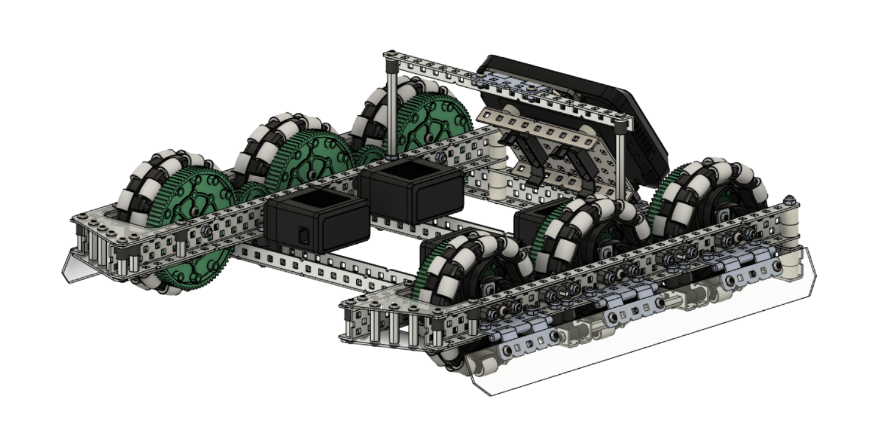
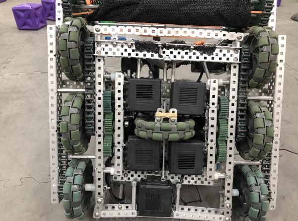
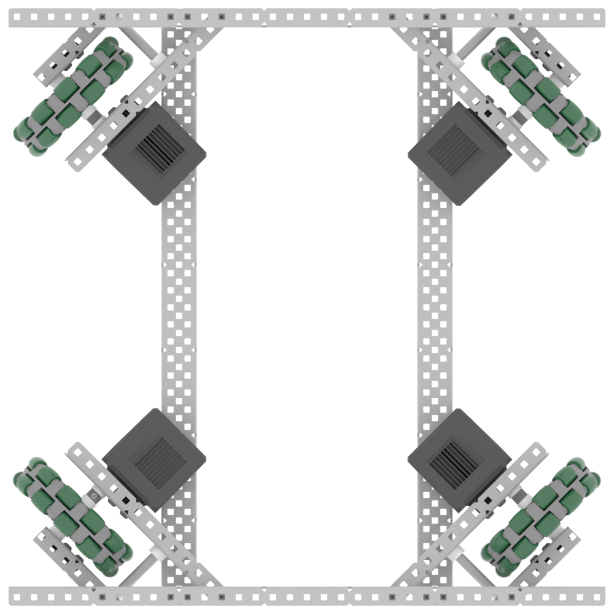
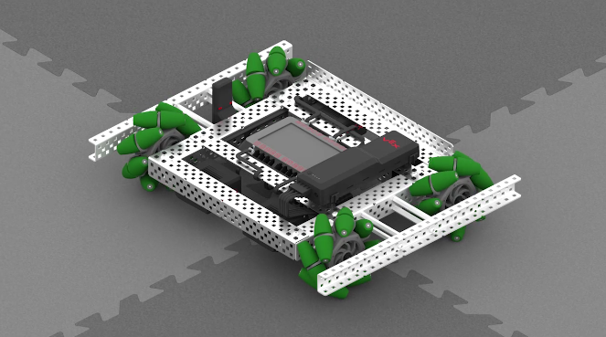

# Drivetrain

There are many things to consider when designing a drivetrain. Your drivetrain is important, so build it well. It might take you some time to do it, but it carries your robot, so it better be good.

## Define Constraints

The first thing you should do when designing a drivetrain is decide what you are actually trying to accomplish.

-   How fast do you want to go?
-   Do you want to be able to resist pushing?
-   Do you need to lift heavy objects?
-   Do you need to cross any barriers?
-   Do you need to fit through tight spaces?
-   Do you need to have subsystems that extend outside of your drivetrain?
-   Do you want to be able to strafe?

Once you decide what you need your drivetrain needs to do, you can decide on what features it should have.

## Features

### Types Of Drivetrain

The most important feature is the type of drivetrain. This will dictate the rest of your decisions afterwards. There are many different styles of drivetrain, and they all come with their own advantages and disadvantages.

#### Tank Drive

This is the traditional style of drivetrain. It consists of at least 4 wheels, of a combination of omni and traction, in parallel.

<figure markdown>
  { width="800" }
</figure>

| Pros                | Cons          |
| ------------------- | ------------- |
| Easy to build       | Cannot strafe |
| Hard to push around |               |

#### H Drive

An H drive is similar to a tank drive, but has an additional driven wheel perpendicular to the rest of the drive that allows the drivetrain to strafe from side to side.

<figure markdown>
  { width="800" }
</figure>

| Pros       | Cons                      |
| ---------- | ------------------------- |
| Can Strafe | Needs an additional motor |

#### X Drive

An X drive has 4 omni wheels at 45 degree angles, forming an x shape. This allows the drivetrain to move in any direction at any time. It's also faster than a traditional tank drive. A more detailed explanation as to why can be found [here](https://web.archive.org/web/20230118013035/https://aura.org.nz/why-is-x-drive-faster/). Note that this increase in speed comes with a proportional decrease in torque. It's wheels must be able to move individually, making it very hard to create gearing besides direct drive for it.

<figure markdown>
  { width="800" }
</figure>

| Pros                   | Cons                        |
| ---------------------- | --------------------------- |
| Can Strafe             | Restricts you to 4 motors   |
| Faster than tank drive | Less torque than tank drive |

#### Mecanum Drive

Mecanum drives use a similar wheel configuration to tank drives, but they use mecanum wheels instead of omni wheels. This allows them to strafe. Note that similarly to the X drive, the wheels must all be able to turn individually.

<figure markdown>
  {width="800"} }
</figure>

| Pros       | Cons                                  |
| ---------- | ------------------------------------- |
| Can Strafe | Doesn't turn easily                   |
|            | Restricts you to 4 motors             |
|            | Can't strafe as quickly as an X drive |

### Size

For Omni or Traction wheels you generally want 6 holes wide. This allows you to fit an Omni wheel and a sprocket inside, even though it’s tight. You do not need to have room for the wheel to turn like a car’s wheels. Mecanum wheels may need more space because they’re larger.

The length of your drivetrain depends on what you want to do. A shorter drivetrain lets you have more open space in the front or back, but you might lose stability with farther back wheels. A longer drivetrain is going to let you be more stable, but you lose space. Many times when designing a drivetrain you should create it in 35 long or 30 long.

### Wheel Size and Gear Ratios

Overall, the main thing to take into consideration are the gear ratios of your drivetrain. There are some drivetrains that use chain to connect motors to wheels, but most modern VEX drivetrains use gears. VEX lets you choose from three motors, 100 RPM, 200 RPM, and 600 RPM. Keep in mind, the higher the RPM, the lower the torque.

You can find a chart of different combinations and speeds [here](https://docs.google.com/spreadsheets/d/1vPlTWsDQKqGa7vXqaLWuJAkPQ2Iz0nnbdUy90Mry-3M/edit#gid=0).

The RPM that you choose is highly dependent on the amount of motors that you have. Typically 4 motor drivetrains use 200 to 300 RPM, while a 6 motor drive might use 200 to 360 RPM. Keep in mind that this is also highly dependent on the wheel size you use. There have been drivetrains using 450 RPM, but 2.75" wheels.

It all comes down to how fast you can go, while still having the ability to move without overheating your motors too quickly.

### Structure

The structure of your drivetrain is an easy part to neglect. You have to provide a solid base for the rest of your subsystems, and if you mess this up, the rest of your build will become a living hell. You need to ensure that your drivetrain maintains right angles and that it also doesn't flex.

This comes in two parts:

-   bracing the drive halves
-   cross bracing the whole drivetrain

When bracing your drive halves, make sure to brace on both the bottom and top of your C-Channel. This can take the form of more C-Channel, or standoffs, or anything else that can enforce the distance between the C-channel.

<figure markdown>
  { width="800" }
  <figcaption>Credit to 99999V for this image</figcaption>
</figure>

Cross bracing your entire drivetrain is also very important. Typically you want at least two C-channels that go across your entire drivetrain. This ensures that your drivetrain remains square. You can further guarantee this by exchanging these C-channels out for 3-channel, or even 5-channel, but this isn't required.

<figure markdown>
  { width="800" }
  <figcaption>Credit to 99999V for this image</figcaption>
</figure>

Remember, just because the metal looked straight in planning, doesn't mean it will actually turn out that way. Bracing is the only way you can guarantee that it stays in the shape you want it to.

### Defensive Features

VEX Robotics is played in a competitive game. This means that there will inevitably be opposing robots trying to prevent your robot from scoring. One way teams will do this is by pushing your robot out of the way, typically from the side. This can be prevented by using a center traction wheel and/or adding skirts/wedges.

#### Center Traction Wheel

A traction wheel in the center of your drivetrain is a very good way of preventing being pushed from the side. However, it is key that the traction wheel is located near the center of rotation for the robot, because it will have the least effect on the turning of the robot. Traction wheels have a lot of grip, but when a robot is turning, this grip works against it, because the wheel must drive in an arc, which means the wheel must skid somewhat. This is why we always recommend using omni wheels, because the small rollers help decrease the friction involved in turning. With the traction wheel in the center of the robot, however, the arc when turning is the smallest, which means the effect of friction is the lowest. Below is a CAD render of 53A’s Worlds drivetrain for Tipping Point, which uses a center traction wheel, along with skirts.

<!--TODO: crop this-->

<figure markdown>
  { width="800" }
</figure>

#### Skirts

Skirts are pieces of lexan mounted on the side of a drivetrain at an angle to prevent pushing. This works by creating a ramp for opposing robots to drive up if they try to push, thus reducing their pushing power in the horizontal direction. These are usually mounted on hinges and backed by a piece of c-channel for rigidity, although alternative methods can be used if hinges stick out past the c-channel too much. Below is a CAD screenshot of 53E’s early season Tipping Point design, with a low profile custom hinge mechanism using standoffs and collars.connected to an 1-by angle.

<figure markdown>
  { width="800" }
</figure>

#### Wedges

Wedges are similar to skirts in that they are a slanted piece designed to cause other robots to ride up them, but wedges are mounted on the back of the drivetrain and typically used in a defensive manner to disrupt opposing robots. Below is a picture of 1721G’s Change Up robot, which was a defense bot that utilized aggressive driving and wedges very well.

<figure markdown>
  { width="800" }
</figure>

## Further Reading

-   [BLRS Wiki: VEX Drivetrains](https://wiki.purduesigbots.com/hardware/vex-drivetrains)
-   [Designing a Quality Drive](https://www.vexforum.com/t/designing-a-quality-drive/81850)
-   [Designing Another Quality Drive](https://www.vexforum.com/t/designing-another-quality-drive/90920)
