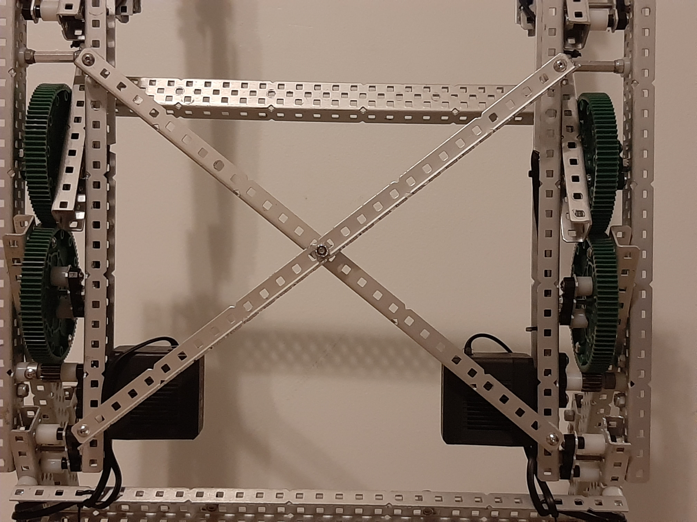

# Lifts

Lifts are necessary when you have to extend upwards. They need to be stable and sturdy because the load they carry is often heavy.

## Define constraints

The first thing you should do when designing a drivetrain is decide what you are actually trying to accomplish.

-   how high do you need to lift?
-   how much weight do you need to lift?

## Features

### Types of Lift

#### Four Bar

As the name suggests, this design consists of 4 pieces of c-channel linked together with joints.

<figure markdown>
{width=800}
</figure>

| Pros                                              | Cons                                                                       |
| ------------------------------------------------- | -------------------------------------------------------------------------- |
| Easy to build                                     | Lack of height                                                             |
| Reliable                                          | Center of gravity is not over the center of the robot (you could tip over) |
| Lifted end does not rotate (stuff won't fall out) | Motion is not linear                                                       |

#### Six Bar

This is a variant of a four bar using six pieces of c-channel instead of four.

<figure markdown>

</figure>

| Pros                             | Cons                                 |
| -------------------------------- | ------------------------------------ |
| Shorter than four bar            | Requires more torque than a four bar |
| Can reach higher than a four bar |

#### Double Reverse Four Bar

This design is essentially two four bars stacked on top of each other.

<figure markdown>
{width=600}
</figure>

| Pros                                    | Cons                      |
| --------------------------------------- | ------------------------- |
| Can reach very high                     | Hard to build             |
| Movement is more linear than a four bar | Heavy and space consuming |

#### Cascade Lift

This lift consists of multiple sections that consists of multiple sections that are pulled upward with chain.

<iframe width="560" height="316" src="https://www.youtube.com/embed/diXEm9aw1Dc" title="cascade lift prototype 1" frameborder="0" allow="accelerometer; autoplay; clipboard-write; encrypted-media; gyroscope; picture-in-picture; web-share" allowfullscreen></iframe>

| Pros                 | Cons               |
| -------------------- | ------------------ |
| Very linear movement | Very hard to build |
| Very compact         |                    |

#### Scissor Lift

<!--TODO: actually write this out-->

### Bracing

Bracing is important to make sure your lift stays structurally sound. There are two major types of bracing you should use on your lifts. More rigid lifts will also improve the effectiveness of the joints, making your lift move faster.

#### Cross Bracing

Cross bracing is a good way to reduce the amount of twisting a lift undergoes. Its a great way to improve the rigidity of the design. This involves putting a piece of C-channel directly across your lift, connecting the two sides, perpendicular to your lifting bars. 3-channel or 5-channel could also be used here.

<!--TODO: image-->

#### X Bracing

X bracing involves forming an x shape with 1x1 angle bars (the "L" shaped ones). Using plate here will not have the desired effect.

<figure markdown>
{width=600}
</figure>

## Further Reading

-   [BLRS Wiki: Lifts](https://wiki.purduesigbots.com/hardware/lifts)
-   [The Kepler Electronics Guide to the DR4B](https://www.youtube.com/watch?v=L37lHD0oB54)

<!--<iframe width="560" height="316" src="https://www.youtube.com/embed/hYC-bCeYGm0" title="Robotics Introduction - Subsystems - 4B/DR4B" frameborder="0" allow="accelerometer; autoplay; clipboard-write; encrypted-media; gyroscope; picture-in-picture; web-share" allowfullscreen></iframe>-->

<!---   Cross bracings (ones that are perpendicular to your lifting bars)-->
<!---   X bracings (ones that cross your lifting bars)-->
<!---   Triangle bracings supporting your posts-->
<!---   Anti tips (we’ll cover this more later, but helps with balance)-->
<!---   Counter weights (use if needed)-->
<!---   Screw joints-->
<!---   Lifts are hard to make, but are very rewarding. Making lifts well is necessary, a good amount of games make your robot extend.-->
