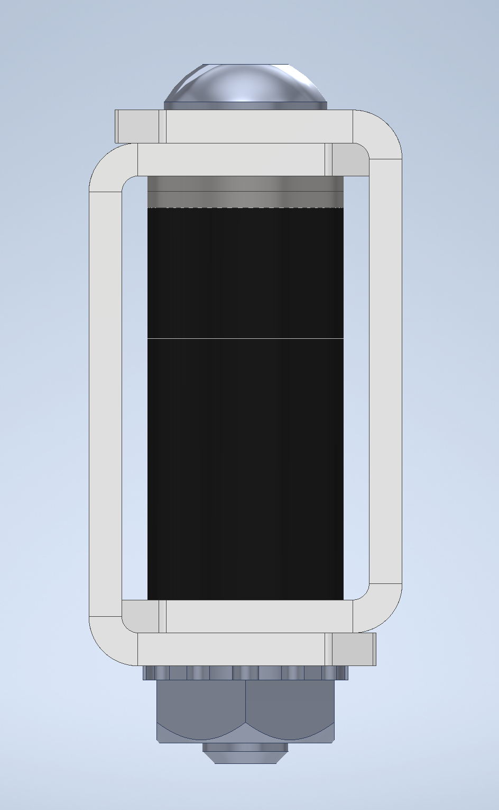

# Boxing

Boxing is a technique that majorly increases the stiffness of structure. This involves putting spacers or standoffs inside of a C-Channel to stop it from being to bend:

<figure markdown>
  { width="300" }
  <figcaption>Credit to 99999V for this image</figcaption>
</figure>

You can also combine two C-Channels together:

<figure markdown>
  { width="400" }
  <figcaption>Credit to BLRS Wiki for this image</figcaption>
</figure>
