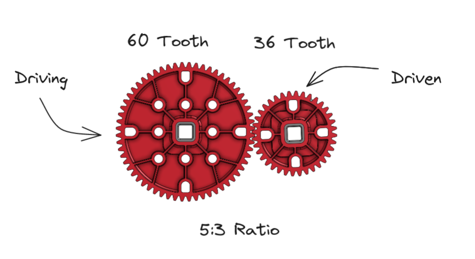

# Gear Ratios

Gear ratios are a key part of being able to influence speed an torque. A gear ratio consists of at least two gears or sprockets of different sizes. Every system has a driven and driving gear. The ratio is only determined by these two gears, all of the other gears can be ignored.

<figure markdown>
  { width="800" }
</figure>

Here is the formula for a gear ratio:

$$
GearRatio=\frac{Driven}{Driving}=Driven:Driving
$$

A gear ratio with a smaller gear to a larger gear will result in an increase in torque, while a larger gear to a smaller gear will result in more speed.

Here's an example:

If we have a motor that spins at 200 RPM, and then connect that motor to a 60 tooth gear which drives a 36 tooth gear, we now have a gear ratio of $60:35$, or $5:3$. Our final gear ratio is now $200*(5/3)$, or $333.\overline{3}$ RPM.
