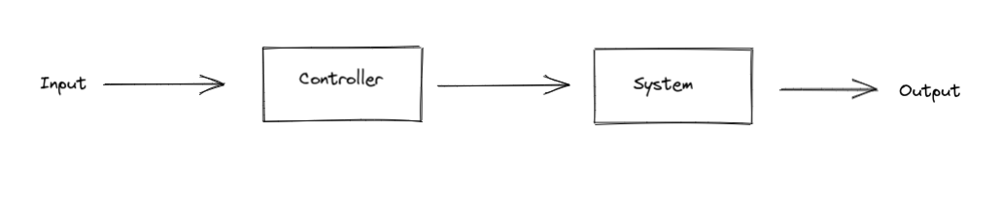
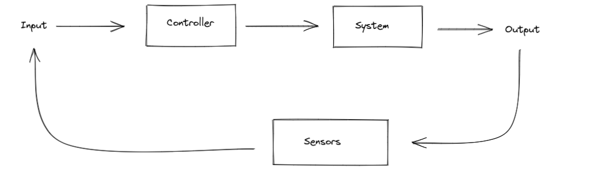

# Control Loops

Control loops are the fundamental part of overall control theory. A control loop brings a system to a target. This can be any system, a thermostat, a car, or even a robot. The target can be anything, the temperature of the system, the position of the system, or even the velocity of the system. As long as there is a way to affect the system, and a desired target, you can apply a control loop. There are two major variants of control loops: open loop control and closed loop control.

## Open Loop Control

In this variant, also known as feedforward control, the loop does not react to the state of the system. A good example of this is the driver controlling the robot. In this case, the robot is the system, and the robot's position is the state of the loop. The driver knows where they want the robot to go (the target), and moves the robot accordingly. In this scenario, the robot is not adjusted based on it's current position, it's adjusted based on the input from the driver. The code is never aware of the robot's position. Here is a visualization of open loop control:

<figure markdown>
  { width="800" }
</figure>

As you can see here, The loop doesn't check the state of the system, it just outputs directly.

## Closed Loop Control

In this variant, also known as feedback control, responds to the state of the system. A good example of this is a thermostat. The thermostat brings the room to a target temperature. It gets the current temperature, and if the current temperature is too low, it will start heating, but if the temperature it too high, it will stop. Here is a visualization of closed loop control:

<figure markdown>
  { width="800" }
</figure>
