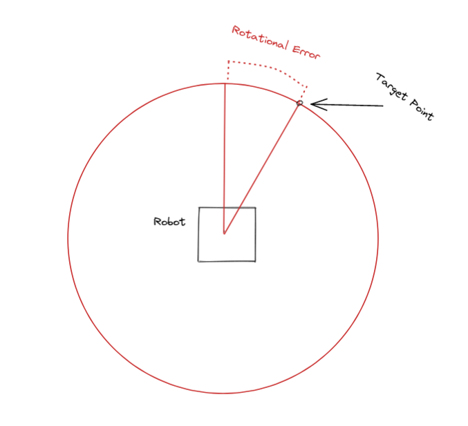
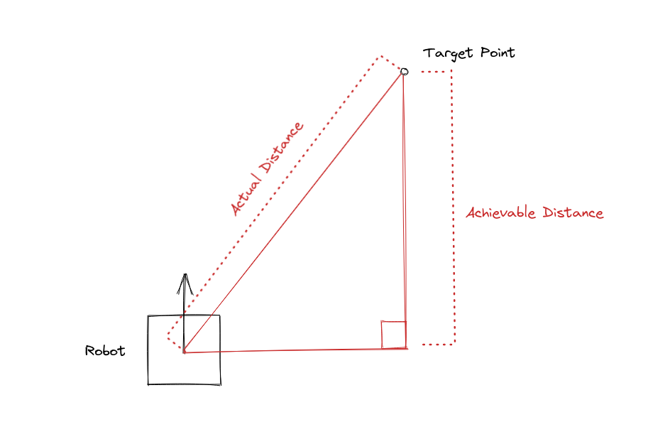

# Moving to 2D Points

## Theory

Odometry lets you visualize the robot in 2D space, however this isn't very useful without a way to traverse that 2D Space. There are many ways to solve this problem, but the simplest way is to use PID. We can use two PID controllers to move the robot. One controller will move the bot towards the point, and the other one will rotate the bot to face the point.

## Math

In order to use PID, we first need error. We have two PID loops, so we'll need to different error values, one for the linear error, and one for the rotational error.

### Rotational Error

This is the amount of degrees between the facing of the robot, and the target point.



Assuming these variables:

-   $\Delta x$ is the change in x coordinate from the current point to target point.
-   $\Delta y$ is the change in y coordinate from the current point to the target point.
-   $e_{rotational}$ is the rotational error, in radians.
-   $\theta_{current}$ is the current rotation of the robot relative to the field, in radians.

$$
e_{rotational}=\theta_{current}-atan2(\Delta y,\Delta x)
$$

### Linear Error

While this seems like it should just be as simple as using the distance formula, it isn't. PID loops are only concerned with the error they can correct for. We want to find the distance that the robot has to travel in order to get us as close as possible to the target point without turning. If we get the actual distance, the error might actually increase as the robot moves, causing a negative feedback loop.



Assuming these variables:

-   $\Delta x$ is the change in x coordinate from the current point to target point.
-   $\Delta y$ is the change in y coordinate from the current point to the target point.
-   $e_{linear}$ is the linear error.
-   $e_{rotational}$ is the rotational error, in radians.

$$
e_{linear}=\sin(e_{rotational})*\sqrt{\Delta x + \Delta y}
$$

## Implementation

This will only cover calculating error, since PID was already covered [here](./pid.md).

```cpp
class Point {
public:
  float x;
  float y;
  float theta;

  Point(float x, float y, float theta = 0) {
    x = x;
    y = y;
    theta = theta;
  }
};

Point targetPoint(10, 10);

while (true) {
  Point currentPosition = getCurrentPosition(); // Get position from odometry

  // update error
  float deltaX = targetPoint.x - currentPosition.x;
  float deltaY = targetPoint.y - currentPosition.y;
  float targetTheta = fmod(radToDeg(M_PI_2 - atan2(deltaY, deltaX)), 360);
  float hypot = std::hypot(deltaX, deltaY);
  float diffTheta1 = angleError(currentPosition.theta, targetTheta);
  float diffTheta2 = angleError(currentPosition.theta, targetTheta + 180);
  float angularError =
      (std::fabs(diffTheta1) < std::fabs(diffTheta2)) ? diffTheta1 : diffTheta2;
  float lateralError = hypot * cos(degToRad(std::fabs(diffTheta1)));

  // Do PID computations ...

  // Move the motors
  leftPower = linearPidOutput - rotationalPidOutput;
  rightPower = linearPidOutput + rotationalPidOutput;

  leftMotors.move(leftPower);
  rightMotors.move(rightPower);
}
```

<!--prettier-ignore-->
!!! note
    Rotational error can very quickly change if the robot crosses the target point. This can cause the robot to spin in circles. You will need to implement something to handle what happens when the robot is near the target.
