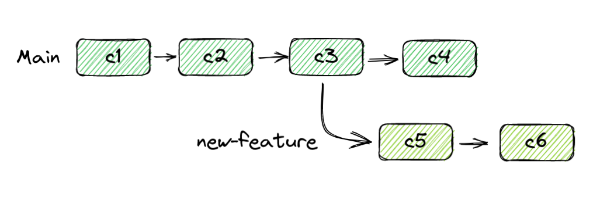

# Branches

## Theory

Branches allow you to create a fork in the timeline of your project.

{ width="800" }

A common use of branches is to create new features. This allows work to be done on another branch without interfering with the main branch. This is useful if you have multiple developers working together, and you don't want to break each other's work. Branches are also a very common way to have different releases, each with their own version.

Each branch has a head, which can be thought of as the tip of that branch. This is always the latest commit on that branch.

### Changing Branches

Git allows you to move between branches at will with the checkout command. Note that while making commits does not change your working directory, this will. Your code will be changed to the code in that branch.

<!--prettier-ignore-->
!!! warning
    You cannot change branches if your current uncommitted changes conflict with what is on the branch you are trying to switch to. If this happens, you can either commit your changes to your current branch, or or stash your changes. For more info, look [here](https://stackoverflow.com/questions/22053757/checkout-another-branch-when-there-are-uncommitted-changes-on-the-current-branch).

## Examples

<!--prettier-ignore-start-->
=== "CLI"
    You can interact with branches like this:
     
    ```sh
    # This branch will look identical to your existing master branch until you make changes
    git branch  my-branch

    # You can switch to this branch with
    git chechout my_branch
    ```

=== "VSCode"
    You can create and interact with branches with the `Git: Create Branch` and the `Git: Checkout to` commands in the command palette. You can access these by typing `Ctrl+Shift+P` and then typing in the name of the respective command.

    <iframe width="617" height="400" src="https://www.youtube.com/embed/b9LTz6joMf8" title="Git: branches in Visual Studio Code" frameborder="0" allow="accelerometer; autoplay; clipboard-write; encrypted-media; gyroscope; picture-in-picture; web-share" allowfullscreen></iframe>
<!--prettier-ignore-end-->
