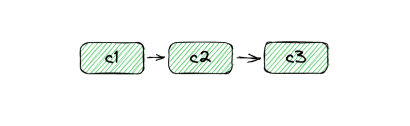

# Commits

When you commit you create a set point in the history of your local repository. Together, the commits form a timeline of your project. When you commit, changes get moved from staging into your local repository as a commit. Keep in mind that this does not change your working directory in any way.

Here is an example of a history with three commits:

{ width="800" }

Every commit has a commit message associated with it. This should summarize the changes made in that commit. Commits also have a hash. This is a unique identifier that is automatically generated whenever a commit is made.
