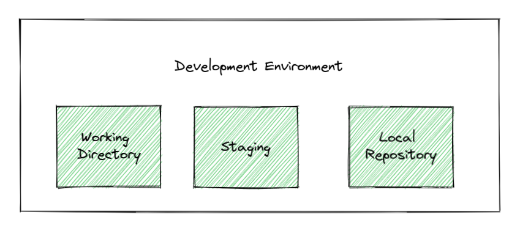

# Local Repositories

The local repository is stored on your computer. When you initialize a git project, a remote repository is created.

Once a local repository is created, your development environment will look like this:

{ width="800" }

The working directory is simply the folder that your git project is created in. This is the base folder of your project, and contains all of your files. This is where you actually do work, and contains all of your code.

Your staging area contains all of the changes you intend to commit.

Your local repository contains your commits and branches.
