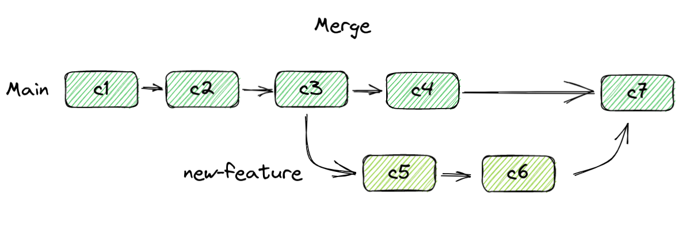
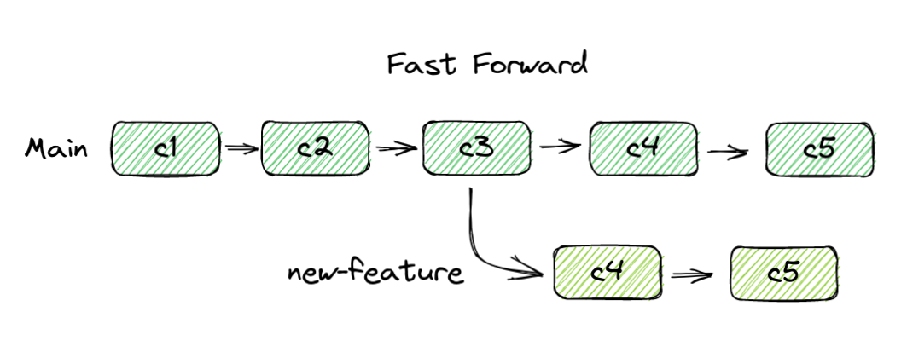
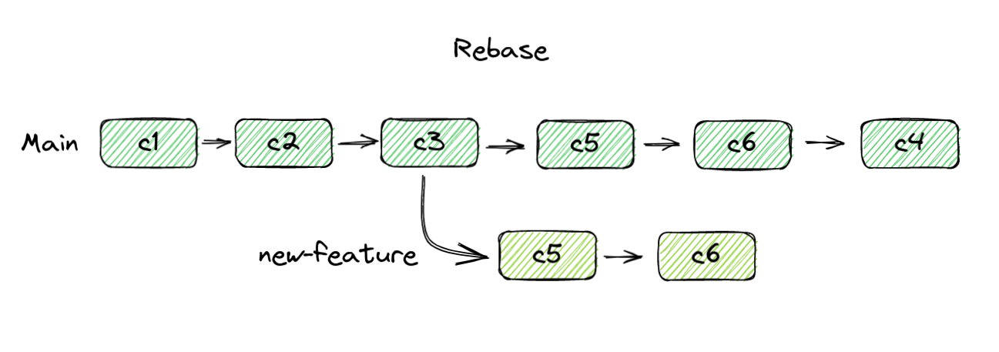

# Merging

Sometimes you want to get commits from one branch and bring them into another one, whether it be to bring in new features, or just get the latest code from the remote repository (we'll cover this later). Git provides a tool for this: merging.

{ width="800" }

Merging will create a new commit on the branch in which the merge is taking place. This commit is a combination of two commits, the latest ones from both branches.

### Fast Forward

If a branch has not diverged from the one that you are merging into, git will resolve the issue via fast forward rather than a traditional merge.

{ width="800" }

This will add commits to the branch that is behind so that the history of the branches is up to date.

## Rebasing

Rebasing is another way to bring changes from one branch to another. This works a little differently from a merge. The result is the same, but they way they interact with history is different. A rebase will insert the commits of a branch backwards in time into the current one.

{ width="800" }

## Merging vs Rebasing

This is a subject of debate among developers. The main source of contention is their effect on history. A rebase will go back in time and change history, while a merge will not. However, a rebase will leave you with a more accurate timeline of your project, showing more clearly what actually happened. Usually going back in time and changing history is frowned upon, hence the conflict.

## Merge Conflicts

Sometimes merges cannot be resolved manually by git due to conflicting changes. When this occurs, merges will need to be resolved manually. This topic is rather complex, so it won't be covered here. You can find more about in in the further reading section.

## Further Reading

-   [Basic Branching and Merging](https://git-scm.com/book/en/v2/Git-Branching-Basic-Branching-and-Merging)
-   [What is git fast forwarding?](https://stackoverflow.com/questions/29673869/what-is-git-fast-forwarding)
-   [Advanced Merging](https://git-scm.com/book/en/v2/Git-Tools-Advanced-Merging)
-   [Rebasing](https://git-scm.com/book/en/v2/Git-Tools-Advanced-Merging)
-   [Git merge conflicts](https://www.atlassian.com/git/tutorials/using-branches/merge-conflicts)
