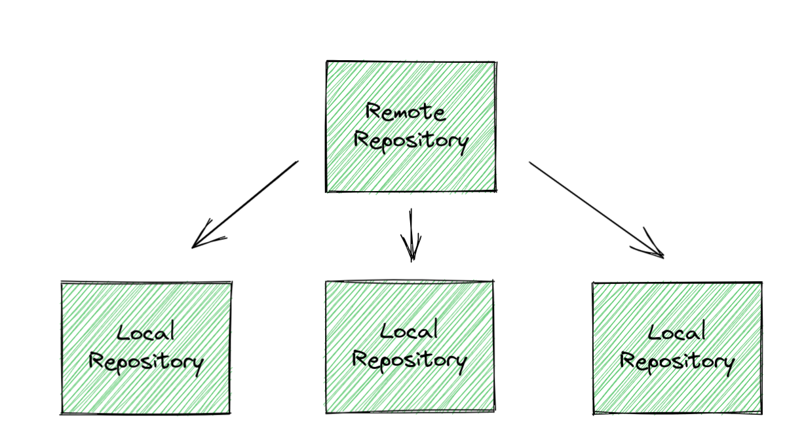
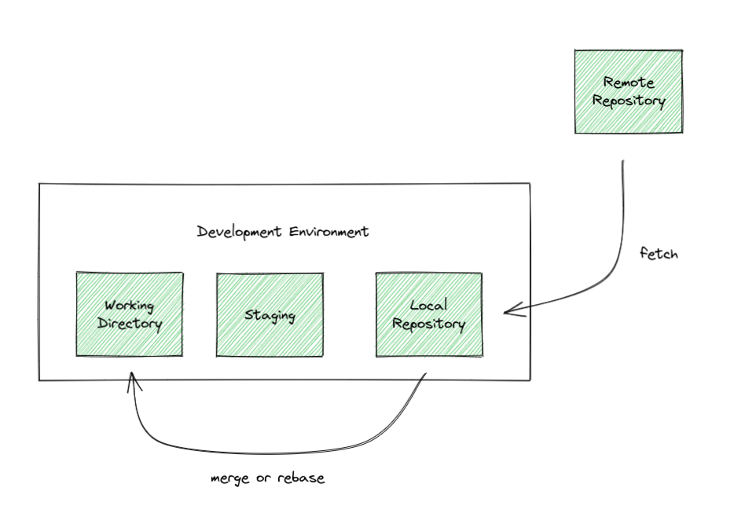
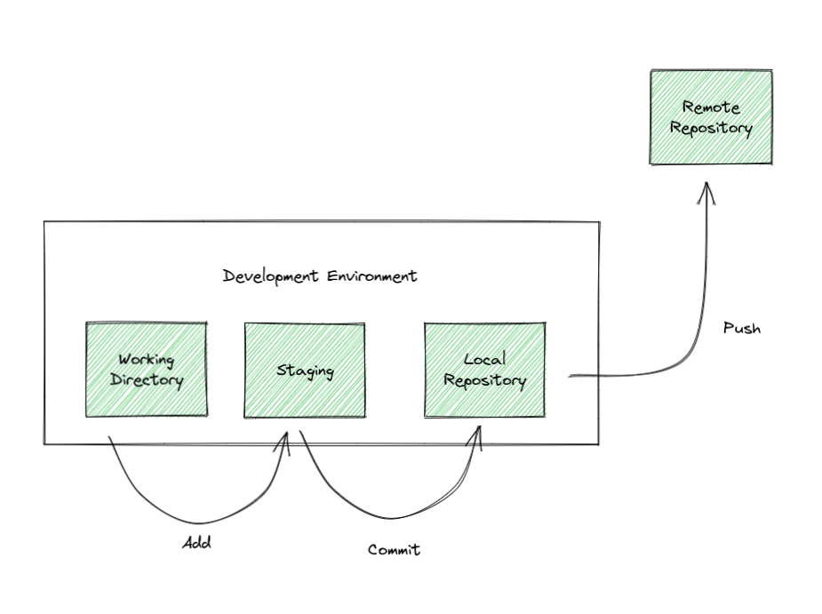

# Remote Repositories

Remote repositories are they way that git enables collaboration between developers. Very commonly these remote repositories are hosted on Github, but it's possible to host your own as well, provided that you have your own server.

{ width="800" }

## Acquiring a Remote Repo

This can be done with clone. This will create a copy of that repository in a new directory on your computer. This only copy the code for the remote repository's current active branch, but it will create remote-tracking branches for the rest of the branches.

<!--TODO: image-->

## Interacting with a Remote Repository

An important thing to remember is that a remote repo is not a direct mirror of the local ones. It will not automatically update as changes are made in local repositories. If you want to interact with the repo, you must do so manually and explicitly.

### Fetch

Fetching will grab all of the metadata from the remote repository, and update your local repository with it. This includes information on branches and commit history.

<!--prettier-ignore-->
!!! note
    Fetches are completely non-destructive, and therefore will never change your working directory. It is always safe to fetch.

### Pull

Pulling will perform a fetch, but in addition it will also try to integrate the changes from the remote repository into the local one.

<!--prettier-ignore-->
!!! note
    A pull will only attempt to integrate into the current branch, not any others.

If the history of the two branches (remote and local) is not divergent, the difference will simply be resolved by [fast forwarding](https://stackoverflow.com/questions/29673869/what-is-git-fast-forwarding). If they are divergent, then a [merge or a rebase](./merging.md) will occur.

{ width="800" }

### Push

A push will update the remote repository's metadata with the local one and send the matching [objects](https://git-scm.com/book/en/v2/Git-Internals-Git-Objects) along with it. If the local and remote repository conflict, the push will not succeed, and will throw an error. If this is the case, you will need to pull the changes from the remote repository to make the history match.

{ width="800" }

## Further Reading

-   [Distributed Git - Contributing to a Project](https://git-scm.com/book/en/v2/Distributed-Git-Contributing-to-a-Project)
