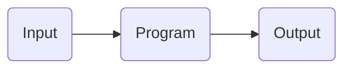

# Software

Coding is a crucial part of robotics. Building may create robots, but coding is what actually brings life to them. Even if you plan on being a builder, it’s important to know at least some basic coding to be able to familiarize yourself with your team’s code as well as solve simple problems in the absence of a coder. In this section we’ll teach you the general coding knowledge you’ll need to be able to create effective and working programs for robotics.

## Programming Mindset

Much of programming is creating programs for your team's robot. But it's also much more than that.

Being a programmer is about You'll need to work with builders, squad leaders, drivers, notebookers, and even other programmers in order to be successful.

### What is programming?

In his first lecture for CS50 2022 (Harvard's introductory computer science course, [which you can check out for free here](https://www.edx.org/course/introduction-computer-science-harvardx-cs50x)), David J. Malan states that computer science is "all about information and...the solving of problems." This problem-solving process essentially boils down to the following diagram:

As a programmer, your main job is to make a **Program** that takes in information (**Input**) and does something with it to produce a desirable outcome (**Output**). Here's how this would work with drive code.

1. **Input:** The inputs are the joystick values sent from the controller to the robot.
2. **Program:** Code that takes the joystick inputs and uses them to send commands to the robot.
3. **Output:** The robot moves as the driver intended.

You'll want to keep all three of these steps in mind when you're programming. Make sure you have all the sensors and peripherals you need for your **Inputs**. Then, find out how to use those inputs in your **Program** to perform some kind of action (**Output**).

### Programming Tips

-   **Communicate with your driver:** Consult your team's driver on how they want to operate the robot using the controller. Design usercontrol code with their preferences in mind.
    -   Furthermore, try to make their life as easy as possible during matches to give them an edge over other teams. Are there any difficult tasks that you can automate for them for more reliable scoring?
-   **Communicate with your builders and team leader:** Work with your team to ensure that your bot has all the sensors you need for your program, and if you need sensors organized in a specific manner, let them know ahead of time so they can account for that in their design.
    -   Don't be afraid to do some mechanical work, either! If you're asked to help with building the robot, lend an extra pair of hands. This can not only speed up the build process, but also give you a better feel for the robot you are programming for and its potential capabilities and limitations included.

## Further Reading

This is the baseline that you will need to program for robotics, but we highly recommend that you read through some other tutorials. We recommend [this](https://www.learncpp.com/) one.
