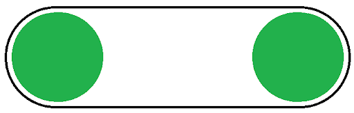

# Intakes

<iframe width="560" height="315" src="https://www.youtube.com/embed/lk-dUcIApZg" title="Robotics Introduction - Subsystems - Intakes" frameborder="0" allow="accelerometer; autoplay; clipboard-write; encrypted-media; gyroscope; picture-in-picture; web-share" allowfullscreen></iframe>

Intakes are very efficient mechanisms that are widely used. There are many takes on them, but the most basic should work just as fine. Building intakes are very easy, although knowing which type to build can be difficult.

<!--TODO: add the images-->

Use flat intakes when:

-   The object you need to pick up is flat
-   You need 1 orientation for your object

Use single-sprocket intakes when:

-   You need to get around a post and have intakes in front and behind the post
-   You need to conform to a lot of different shapes

Use only tread when:

-   You need support, but nothing else

    Use chain-backed tread when:

-   You need a lot of support
-   This is when you have 3 sprockets stacked on top of each other with the top and bottom sprockets using chain and the middle sprocket using tread. The chain should be inside the tread and will provide support to the top and bottom of the tread.

    Use rubber band-wrapped gears or rubber band-wrapped, chain-wrapped sprockets or traction wheels when:
    You want a thin but solid intake
    Use omni-wheels when:
    You want your intake to be able to move up and down
    This will also increase the variability in your intakes

Another important thing to know about intakes is your release point. Compression also becomes a factor here. Compression describes the friction between 2 objects, 1 that you’re trying to move. Too great and it’ll stay still, too little and there’ll be no force. For intakes this is especially important as they are constantly being used and efficiency is key.
If your intakes need to extend in a direction make sure to consider this:

### Flip-down intakes

-   Swing down, allowing for vertical storage
-   If they are over-compressed, the screw joint will fail
    Unstable closer to the end of the intakes
    Flip-out intakes:

-   Swing parallel to the ground, allowing for side storage
-   Allows for variable compression to a degree
-   As long as they are kept parallel, they’ll be fine

### Punch-out intakes

-   Uses linear slides to guide the intakes
-   Exact compression
-   Needs space for slides
