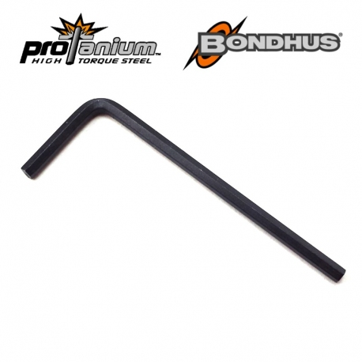
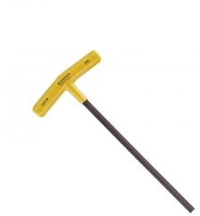
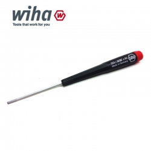
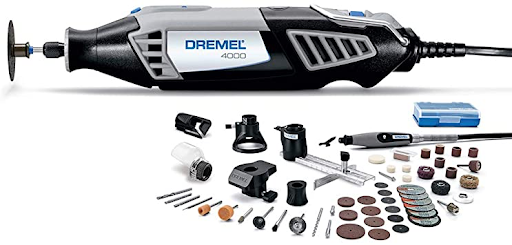
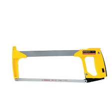
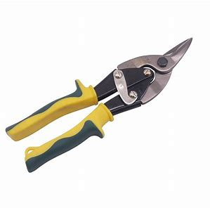
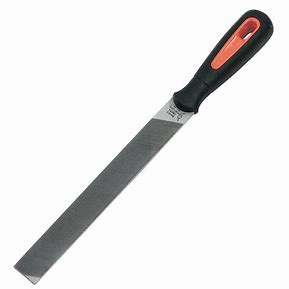
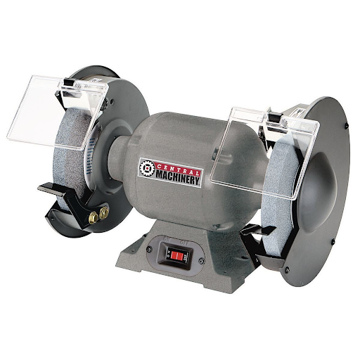

# Tools

Here is a list of all the tools we have in robotics. They will be a picture, common names, and uses.

## Screwdrivers and wrenches

### Allen Wrench

- Also called an “L” or “L wrench”.
- Fits 8-32 hex screws, the common screw we use.
- This is the hardest hex driver to use, although it works best in small places and when supplies are short.

### Motor Allen

Same as the allen wrench, but fits 6-32 hex screws.

6-32 hex screws are mainly used in collars.

### T Hex Driver

Also called a “T” or “T wrench”.

Fits 8-32 hex screws, the common screw we use.

This is another hard hex driver to use because of the long length of the driver as it can twist. But, works well for additional reach or torque.

### German

Fits 8-32 hex screws, the common screw we use.
This is the best hex driver to use if you have it. It’s very strong and it’s amazing for anything in general.

### Wrench

The large head is used to hold nuts to tighten screws, the small head is used to tighten standoffs.

Used with any hex driver or another wrench.

### Ratchet

Used to tighten screws, but can only turn one direction.

Useful in tight spaces where you can’t turn 360 degrees.

## Saws and Files

Wear eye protection when using any type of saw, especially a fast moving saw. Also please learn to use these from someone with experience before trying. I won’t give any warnings here, so follow your instructor’s instructions or the product’s warnings.

### Dremel

Used to cut metal and various plastic parts.

It’s better to use a dremel to cut through steel and a hacksaw to cut through aluminum.

### Hacksaw

Used to cut metal and various plastic parts.

It’s better to use a hacksaw to cut through aluminum and a dremel to cut through steel.

### Snips

Large scissors used to cut aluminum quickly.

Often leaves the surface with rough edges.

### File

Used to remove sharp edges from metal.

You can also use files to strip teeth off of a gear, although I would not recommend it (I’ve done it before).

### Grinder

Also called a “bench grinder”

Used to remove sharp edges from metal.
